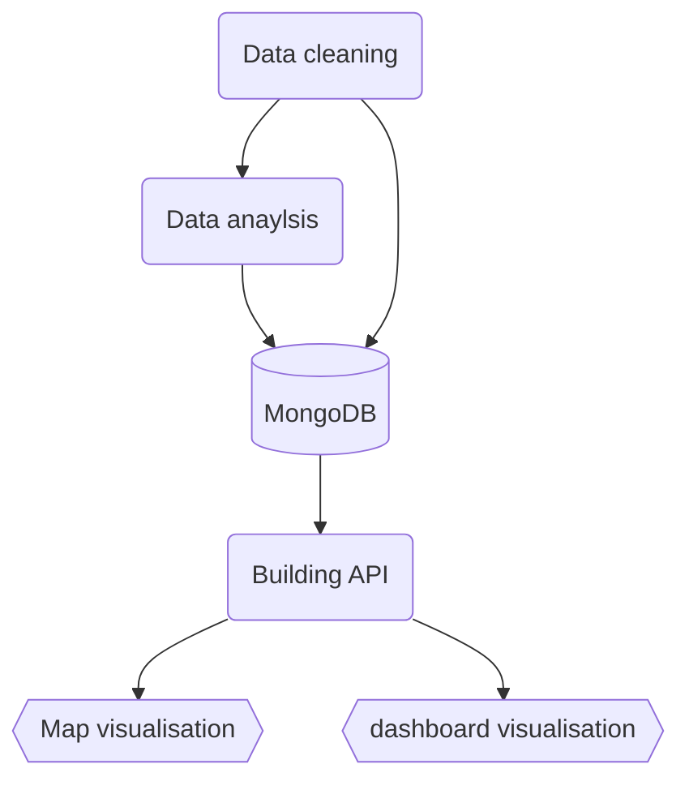
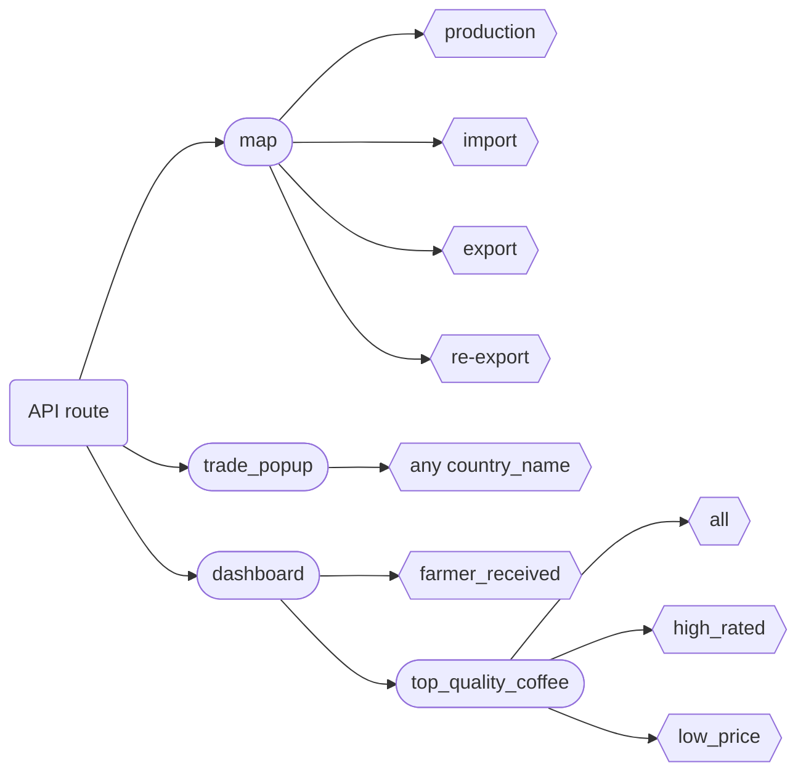

# Project 3: Global Coffee Trade Analysis and Outstanding coffee comparison

## Project Summary

This project is expanded from the coffee project [(Top Quality Coffee Bean Production Chain)](https://github.com/wingylui/Self-project_Coffee) done previously. This project start with understanding the trading of coffee beans in between 1990 to 2019, including import, export, re-export and production in difference between countries. Then, this project will mainly investigate the bean selling price by the farmer is comparable to the retail price in between 1990 to 2019. The results suggesting that the bean selling price and retail price have increased approximately 2.5x and 7.5x respectively, in between 1990 to 2019. Finally, the project finished with analysis of top quality coffee reviewed by [Coffee review](https://www.coffeereview.com/). This section is mainly focusing on investigating which countries and coffee plant species produced most of the high quality coffee, as well as, the retail price of these high quality coffee.

#### Please go to this [website](https://wingylui.github.io/Coffee_Trading/) for data visualisation.

---
<b>Dataset: </b> [Dataset file](https://github.com/wingylui/Coffee_Trading/tree/main/Dataset/international_coffee_organization), [high quality coffee from last project](https://github.com/wingylui/Self-project_Coffee/blob/main/web_scaping/output_data_csv/coffee_bean_cleaned.csv) </br>
<b>Database: </b> MongoDB </br>
<b>Building API:</b> Python (Flask and jsonify) </br>
<b>Data visualisation:</b> Javascript (leaflet and ploty)

<b> Workflow for this project:</b>


---
## Data cleaning

<b> Programming language and package used:</b> Python (Pandas, numpy and json)</br>
<b> Script:</b> [trading_data_conversion.ipynb](https://github.com/wingylui/Coffee_Trading/blob/main/dataset_conversion/trading_data_conversion.ipynb)</br>
Dataset [(worldmap)](https://github.com/wingylui/Coffee_Trading/blob/main/Dataset/worldmap.csv) consist of all the geo shape data from each country and dropped unwanted columns. Then, each country name in the datasets (both from international coffee organization and coffee reviews) were checked to ensure they matched to the geo shape data. Then, all dataframes were ensured that they consist the right type (int/float) from each columns before export them into json file using ```df.to_json ```

---
## Data analysis and convert to data visualisation format

<b>Programming language and package used:</b> Python (Pandas, json and numpy)</br>
<b>Script:</b> [top_quality_coffee.ipynb](https://github.com/wingylui/Coffee_Trading/blob/main/Background_data_analysis/top_quality_coffee.ipynb)</br>
In this section, the [high quality coffee data](https://github.com/wingylui/Self-project_Coffee/blob/main/web_scaping/output_data_csv/coffee_bean_cleaned.csv) were converted into a organised json format for data visualisation in the dashboard. The dashboard seperated into three sections, (1) all of high quality coffee rated by coffee review, (2) very high rated coffee (scored 97 or above) and (3) high quality coffee with low price (under USD $35/kg). Each section includes:</br>

- Top 10 coffee plant species used to roast these coffees 
- Top 10 countries growing these high quality coffee beans 
- Top 10 countries roasting these coffee beans
- The price range of each coffee blend
- Coffee roast level

After the conversion is finished, each dataframe was grouped into the three sections and exported as json files.

---
## Import into MongoDB database

<b>Programming language and package used:</b> Python (pymongo, pprint)</br>
As most of the datasets were stored into json files already, NoSQL database (MonogoDB) was selected to store all the raw data. All json files were imported as in [NoSQL_setup.ipynb](https://github.com/wingylui/Coffee_Trading/blob/main/API_creation_and_management/NoSQL_setup.ipynb) and checked the correct file is imported into the database before building the API.

---
## Building API

<b>Programming language and package used:</b> Python (pymongo, numpy, flask and flask_cors)</br>
<b>Script:</b> [API_app.py](https://github.com/wingylui/Coffee_Trading/blob/main/API_creation_and_management/API_app.py) </br>

<b>API routes:</b>

To visualise the data in map, all geo-shape coordinates were included along with the dataset and exported as geojson file via Flask. After extracting each dataset from database, the coordinates for each countries were then extracted from mongoDB database using ```.find_one(query_country)``` and organised dictionary and exported as a geojson file.

For the pop-up line graph in trading map, the API will receive a country name and query the correct information for the particular country and convert the data into x-axis/y-axis format to easily create line graph in javascript. The API will automatically response data with import/consumption/re-export or production/export data depends on import or export countries.

Lastly, in farmer received dashboard, the retail price and bean selling price by the farmer were averaged before exporting the json file.

---
## Data Visualisation:

<b>Programming language and package used:</b> Javascript (leaflet, plotly and d3.js)</br>
<b>Map Script:</b> [map.js](https://github.com/wingylui/Coffee_Trading/blob/main/web/js/map.js), [map.html](https://github.com/wingylui/Coffee_Trading/blob/main/web/html/map.html) and [map.css](https://github.com/wingylui/Coffee_Trading/blob/main/web/css/map.css)</br>
<b>Dashboard Script:</b> [dashboard.js](https://github.com/wingylui/Coffee_Trading/blob/main/web/js/dashboard.js), [dashboard.html](https://github.com/wingylui/Coffee_Trading/blob/main/web/html/dashboard.html) and [dashborad.css](https://github.com/wingylui/Coffee_Trading/blob/main/web/css/dashboard.css)</br>
The data visualisation has two parts: (1) Map and (2) Dashboard.

### Map
Two functions were in this section:
- <b>Toggle on/off for import/re-export/production/export:</b></br>
Each section can be toggle on and off by the user and the legend will be switch on/off depends on the section that user viewing. Each section was displaying the total amount of import/re-export/production/export of each country in between 1990 to 2019
- <b>Pop-up line graph for each country:</b></br>
Once the user click on a country, detail information from 1990 to 2019 of import/consumption/re-export or production/export will be displayed automatically.</br>
Example:</br>


### Dashboard
Two sub-selections were in this section:
- <b>Global average of bean selling price by farmer and retail price</b> </br>
This section displayed the retail price and bean selling price by farmer throughout 1990 to 2019. The results suggesting that the bean selling price and retail price have increased approximately 2.5x and 7.5x, respectively.</br>


- <b>Top Quality Coffee:</b></br>
This section investigated the regions/locations and coffee plant species that produced high quality coffee. The retail price and the roast level also been reviewed. Coffee beans that are high-rated (scored more than 97) mainly growed in Panama and from the Geisha species, and roasted in US. Although the pricing of most of the high quality coffee are quite expensive, there are still 34 of them are under USD $35/kg. Most of the affordable high quality coffee are from Ethiopia and roasted in Taiwan or US.</br>
Example:</br>


For more detail, please go to [this website](https://wingylui.github.io/Coffee_Trading/).

---
## Statistical Analysis:
<b>Programming language and package used:</b> Python (Pandas, numpy adn scipy.stat)</br>
<b>Script:</b> [Farmer_Received.ipynb](https://github.com/wingylui/Coffee_Trading/blob/main/Background_data_analysis/Farmer_Received.ipynb)</br>

---
### Reference:
- [international coffee organization](https://www.ico.org/)
- [Coffee review](https://www.coffeereview.com/)
- [Worldmap geo shape](https://public.opendatasoft.com/explore/dataset/country_shapes/export/)