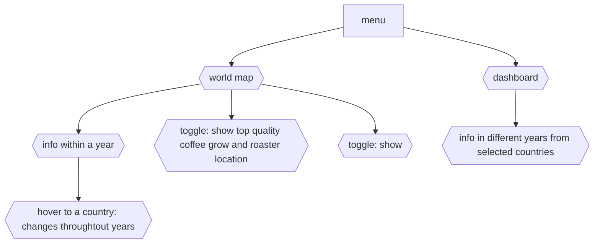

## Project 3: Coffee Trading around the World
---
### Basic Summary

Based on the coffee project [(Top Quality Coffee Bean Production Chain)](https://github.com/wingylui/Self-project_Coffee) done previously, I will expand this into a bigger project about the trading of coffee beans and consumption of coffee in between 1990 to 2019 and also look at the retail price difference between countries. After that, I will also include some data from the top quality coffee and understand which country grow higher quality of coffee

---

<b>Dataset: </b> [Dataset file](https://github.com/wingylui/Coffee_Trading/tree/main/Dataset/international_coffee_organization), [high quality coffee from last project](https://github.com/wingylui/Self-project_Coffee/blob/main/web_scaping/output_data_csv/coffee_bean_cleaned.csv)
<b>Database: </b> MongoDB
<b>API:</b> flask, jsonify
<b>data visualisation:</b> leaflet and ploty, still finding a new JS library

---
### Planning Data Visualisation:

Hopefully, will have a main menu that asking user want to see:
- the different information (import, export, consumption etc.) from a few selected country throughout multiple years or,
- the world map that show import, export, consumption information within a single year, and if the user interested, they can click the country and understand the changes throughout years 
Also, in the world map, there will be a toggle about where are top quality coffee bean grow, and the roaster location.

---
### Time planning:
- 28-1/4 finishing data clean and but in json format
- 1-4/4 finishing API build up
- 4-11/4 build up the interactive dashboard Javascript 

---
### Reference:
- [international coffee organization](https://www.ico.org/)
- [Coffee review](https://www.coffeereview.com/)